<!-- Header -->
<h1 align="center">
  
</h1>

  🚀 Passionate about breaking things (in the right way!) and making software <strong>bulletproof</strong>.  
  I thrive on test automation, performance engineering, and exploring how <strong>AI</strong> can shape the future of QA.  

---

### 👨‍💻 About Me & My QA Philosophy  

- 💼 **Software Quality Assurance Engineer (ISTQB® Certified – CTFL)** — blending code and curiosity.
- 🌍 Freelancing on [Upwork](https://www.upwork.com/freelancers/~014faae15050f47440) & [Fiverr](https://www.fiverr.com/p_ahmed_).  
- 🧪 Skilled in **automation frameworks, API testing, performance testing, and DevOps-integrated QA**.  
- 🎯 **Vision**:  
  - Master advanced QA & reliability testing.  
  - Explore **AI-driven QA** and **intelligent test automation**.  
  - Grow into **QA leadership & reliability engineering** roles.  
- 🎮 Outside work: anime fan, gamer, bookworm 📚, and lifelong learner.  

💡 **My QA Philosophy**:  
> *“Testing is not just about finding bugs 🐞 — it’s about building confidence in software.”*  

- 🔍 **Prevent, not just detect** — testing should influence design early.  
- 🤝 **Collaborate with devs** — quality is everyone’s responsibility.  
- 📊 **Measure reliability** — performance & resilience matter as much as features.  
- 🤖 **Automate smartly** — focus on maintainable, meaningful tests.  

---

### 🛠️ Tech Stack  

#### 💻 Programming & Scripting  
&nbsp;
&nbsp;
&nbsp;

#### 🤖 Test Automation  
&nbsp;
&nbsp;
&nbsp;
&nbsp;
&nbsp;
&nbsp;

#### 🔗 API Testing  
&nbsp;
&nbsp;
&nbsp;

#### ⚡ Performance & Reliability  
&nbsp;
*(experimenting with k6 & Chaos Engineering 🌀)*  

#### 📂 Collaboration & Project Management  
&nbsp;
&nbsp;
&nbsp;

#### 🗄️ Databases & IDEs  
&nbsp;
&nbsp;

#### 🔧 Version Control & CI/CD  
&nbsp;
*(learning GitHub Actions, Jenkins, Docker 🐳)*  

---

### 🌱 Career Journey  

```mermaid
timeline
    title Pollab Ahmed - QA Explorer
    Entry : Functional QA → discovering bugs 🐞
    Growth : Test Automation + API + Load Testing ⚡
    Next : Performance & Reliability QA → breaking limits 🚀
    Future : AI-driven Testing + QA Leadership 🤖✨
```

---

### ⭐ Featured Projects

 <em>Hands-on QA work: automation, API, performance, mobile & modern frameworks.</em> 

API Automation — Cypress
<a href="https://github.com/P-Ahmed/cypress-api-automation-DmoneyUser">cypress-api-automation-DmoneyUser</a>

API test suite with Cypress—clean structure, reusable commands, and CI-friendly.

Mobile App Automation — Appium (EMI Calculator)
<a href="https://github.com/P-Ahmed/EMI_Calculator_app_automation">EMI_Calculator_app_automation</a>

Android UI flows automated with Appium + TestNG; data-driven and readable tests.

Web UI Automation — Selenium + TestNG
<a href="https://github.com/P-Ahmed/TestNG_Maven-demo.midtrans.com">TestNG_Maven-demo.midtrans.com</a>

End-to-end checkout flows with robust assertions and maintainable page objects.

Recruitment Assignment — Selenium Java
<a href="https://github.com/P-Ahmed/TransMedia-QA-Recruitment-Assignment">TransMedia-QA-Recruitment-Assignment</a>

Automation tasks for a demo shop—focused on speed, clarity, and correctness.

---

### 🌐 Let’s Connect

 &nbsp;&nbsp; &nbsp;&nbsp; &nbsp;&nbsp;  

---

✨ Thanks for visiting my profile — let’s build and break software together! 🛠️🐞

  🎓 Proudly ISTQB® Certified — CTFL  

